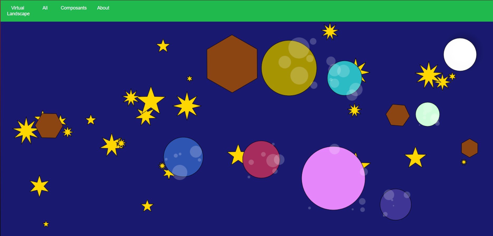
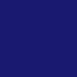
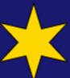
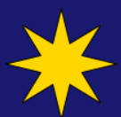
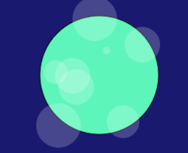
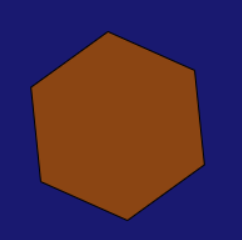

= Projet Virtual landscape Master
:toc-title: Sommaire
:toc: top

Projet réalisé par : +
TRAN Nicolas

20/03/2023 au 14/05/2023

== Contexte +
Dans le cadre du projet Virtual landscape Master, nous avons utiliser une application en javascript (canvas) afin de créer un générateur de paysage virtuel et de développer notre créativité.

== Introduction +
Pour mon projet, j'ai décidé de prendre le thème de l'espace car c'est un thème qui plaît et que les objets me semblaient abordable à mon niveau.

== Présentation du projet +

Ce projet nous montre un paysage de l'espace composé de 4 objets : +

* Lune
* Etoile
* Planete
* Meteorite

Les objets sont basés sur l'aléatoire, c'est à dire que les objets ont ont des emplacements, tailles, couleurs(Planete), formes(Etoile) différentes à chaque actualisation de la page (sauf pour la Lune qui a une taille,emplacement fixe).

Pour pouvoir afficher les objets, on utilise le constructeur Abstact form qui permet de définir les valeurs

[source,java]
class AbstractForm {
constructor(
    x = 0,
    y = 0,
    width = 0,
    height = 0,
    fillColor = '',
    strokeColor = '',
    strokeWidth = 2,
    pesanteur = false,
    ordreConstruction = 100
) {

=== Fond
Pour le fond, j'ai chosi un bleu nuit

[source,java]
background: radial-gradient( farthest-corner circle at left bottom, #191970, #191970);

=== Objets
==== Etoile

Pour les étoiles j'ai décidé de faire 3 formes:

[source,java]

    ctx.beginPath()
    let x = this.x + this.width / 2;
    let y = this.y + this.height / 2;
    let radius = this.width / 2;
    let spikes = ~~(Math.random() * 5) + 5;
    let rot = Math.PI / 2 * 3;
    let step = Math.PI / spikes;
    ctx.moveTo(x, y - radius)
    for (let i = 0; i < spikes; i++) {
      x = this.x + this.width / 2 + Math.cos(rot) * radius;
      y = this.y + this.height / 2 + Math.sin(rot) * radius;
      ctx.lineTo(x, y);
      rot += step
      x = this.x + this.width / 2 + Math.cos(rot) * radius * 0.4;
      y = this.y + this.height / 2 + Math.sin(rot) * radius * 0.4;
      ctx.lineTo(x, y);
      rot += step
    }
    ctx.lineTo(this.x + this.width / 2, this.y + this.height / 2 - radius)
    ctx.closePath()
    ctx.fill()
    ctx.stroke()

Ce code permet de créer les étoiles.

[source,java]
static buildForms() {
    const forms = []
    const maxStars = 30
    const minSize = 20
    const maxSize = 100
    for (let i = 0; i < maxStars; i++) {
      const size = Math.floor(Math.random() * (maxSize - minSize + 1)) + minSize
      const x = Math.floor(Math.random() * (window.innerWidth - size))
      const y = Math.floor(Math.random() * (window.innerHeight - size))
      const fillColor = 'gold'
      const strokeColor = ''
      const strokeWidth = 1
      const pesenteur = false
      forms.push(new Etoile(x, y, size, fillColor, strokeColor, strokeWidth, pesenteur))
    }
    return forms
  }

Ce code renvoie un tableau des étoiles grâce à la méthode buildForms().

==== Planete

Les Planètes ont des couleurs,tailles et des taches aléatoires.

[source,java]

ctx.beginPath()
    ctx.arc(this.x + this.width / 2, this.y + this.height / 2, this.width / 2, 0, 2 * Math.PI)
    ctx.closePath()
    ctx.fill()
    ctx.stroke()

Ce code permet de dessiner un cercle.

[source,java]

if (this.fillColor) {
      ctx.fillStyle = 'rgba(255, 255, 255, 0.2)'
      const spotCount = Math.floor(Math.random() * 5) + 5
      for (let i = 0; i < spotCount; i++) {
        const spotSize = Math.floor(Math.random() * (this.width / 5))
        const spotX = Math.floor(Math.random() * this.width) + this.x
        const spotY = Math.floor(Math.random() * this.height) + this.y
        ctx.beginPath()
        ctx.arc(spotX, spotY, spotSize, 0, 2 * Math.PI)
        ctx.fill()
      }
    }

Ce code permet de générer des taches aléatoire.

[source,java]

static buildForms() {
    const forms = []
    const maxPlanetes = 7
    const minSize = 50
    const maxSize = 200
    for (let i = 0; i < maxPlanetes; i++) {
      const size = Math.floor(Math.random() * (maxSize - minSize + 1)) + minSize
      const x = Math.floor(Math.random() * (window.innerWidth - size))
      const y = Math.floor(Math.random() * (window.innerHeight - size))
      const fillColor = `rgb(${Math.floor(Math.random() * 256)}, ${Math.floor(Math.random() * 256)}, ${Math.floor(Math.random() * 256)})`
      const strokeColor = ''
      const strokeWidth = 1
      const pesenteur = false
      forms.push(new Planete(x, y, size, fillColor, strokeColor, strokeWidth, pesenteur))
    }
    return forms
  }

Ce code permet revoie un tableau des planètes avec la méthode buildForms()

==== Lune

Il n'y a qu'une seule lune et elle a une taille, positionnement et couleur fixe

[source,java]

static buildForms() {
const forms = [];
const x = window.innerWidth - 150; // position the moon on the upper right corner with a 50px margin
const y = 50;
const fillColor = 'white';
const strokeColor = '';
const strokeWidth = 1;
const pesenteur = false;
forms.push(new Lune(x, y, 100, fillColor, strokeColor, strokeWidth, pesenteur));
return forms;
    }

Ce code permet de retourner un tableau de la Lune avec la méthode buildForms().

==== Méteorite

Les météorites ont une forme d'hexagone, ils sont marrons mais avec des tailles et des positions aléatoire.

[source,java]

ctx.beginPath();
    const nbFaces = 6; // une météorite a 6 faces
    const angle = (2 * Math.PI) / nbFaces; // angle entre deux faces
    const rayon = this.width / 2; // rayon du cercle englobant la météorite
    const decalage = Math.random() * angle; // angle aléatoire pour dessiner la météorite
    ctx.moveTo(
      this.x + rayon * Math.cos(decalage),
      this.y + rayon * Math.sin(decalage)
    ); // On se place sur le premier sommet
    for (let i = 1; i <= nbFaces; i++) {
      const currentAngle = decalage + i * angle;
      ctx.lineTo(
        this.x + rayon * Math.cos(currentAngle),
        this.y + rayon * Math.sin(currentAngle)
      );
    }
    ctx.closePath();
    ctx.fill();
    ctx.stroke();

Ce code permet de dessiner un hexagone.

[source,java]

static buildForms() {
    const forms = [];
    const maxMeteorites = 4;
    const minSize = 50;
    const maxSize = 200;
    for (let i = 0; i < maxMeteorites; i++) {
      const size = Math.floor(Math.random() * (maxSize - minSize + 1)) + minSize;
      const x = Math.floor(Math.random() * (window.innerWidth - size));
      const y = Math.floor(Math.random() * (window.innerHeight - size));
      forms.push(new Meteorite(x, y, size, '#8B4513', '', 1, false));
    }
    return forms;
  }

Ce code revoie un tableau des météorites.

=== Conclusion

Ce projet nous a appris programmer dans une approche objet et événementielle en prenant  en main une application javascrist sans framework, d'aborder une nouvelle technologie en mode autodidacte et enfin de développer notre créativité.
